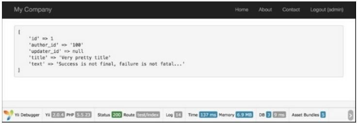

Автоматическая настройка автора
===
Поведение Blameable позволяет автоматически обновлять одно или несколько полей авторов. Это в основном используется для заполнения данных в поля created_by и updated_by. Подобно поведению Метки времени, можно легко задать некоторые специальные параметры и важные события для этого поведения.
Вернемся к примеру из предыдущего раздела. У нас также есть посты нашего блога. Например, предположим, что наша модель блога называется Blogpost. Модель имеет author_id, поле, которое указывает на то, кто создал этот пост, и updater_id, поле, которое указывает на то, кто обновил. Мы хотели бы заполнить эти атрибуты автоматически во время событий создания / обновления модели. Сейчас вы можете узнать, как это сделать.

Подготовка
---

1 Создайте новое приложение с помощью composer, как описано в официальном руководстве  <http://www.yiiframework.com/doc-2.0/guide-start-installation.html>. 
по русски <http://yiiframework.domain-na.me/doc/guide/2.0/ru/start-installation>

2 Настройте подключение к базе данных и создайте таблицу с именем blog_post следующим образом:
```php
DROP TABLE IF EXISTS 'blog_post';
CREATE TABLE IF NOT EXISTS 'blog_post' (
'id' INT(10) UNSIGNED NOT NULL AUTO_INCREMENT,
'author_id' INT(10) UNSIGNED DEFAULT NULL,
'updater_id' INT(10) UNSIGNED DEFAULT NULL,
'title' VARCHAR(255) NOT NULL,
'text' TEXT NOT NULL,
PRIMARY KEY ('id')
);
```

3 Используйте Gii для создания модели BlogPost для таблицы blost_post.

Как это сделать...
---

1 Добавьте следующий метод поведения в models/BlogPost.php: 
```php
<?php
namespace app\models; 
use Yii;
use yii\db\BaseActiveRecord;
/**
* This is the model class for table "blog_post".
*
* @property integer $id
* @property integer $author_id
* @property integer $updater_id
* @property string $title
* @property string $text */
class BlogPost extends \yii\db\ActiveRecord {
/**
* @return array 
*/
    public function behaviors()
    {
        return [
                [
                    'class' => 'yii\behaviors\BlameableBehavior',
                    'attributes' => [BaseActiveRecord::EVENT_BEFORE_INSERT => 'author_id', BaseActiveRecord::EVENT_BEFORE_UPDATE => 'updater_id']
                ]
                ];
    }
}
```

2 Создание controllers/TestController.php следующим образом:
```php
<?php
namespace app\controllers;
use app\models\BlogPost; 
use app\models\User; 
use Yii;
use yii\helpers\Html; 
use yii\helpers\VarDumper; 
use yii\web\Controller;
/**
* Class TestController.
* @package app\controllers */
class TestController extends Controller {
	public function actionIndex()
	{
		$users = new User();
		$identity = $users->findIdentity(100);
		Yii::$app->user->setIdentity($identity);
		$blogPost = new BlogPost();
		$blogPost->title = 'Very pretty title';
		$blogPost->text = 'Success is not final, failure is not fatal...'; 
		$blogPost->save();
		return $this->renderContent(Html::tag('pre', VarDumper::dumpAsString( $blogPost->attributes)));
	}
}
```

3 Вот и все. Теперь запустите test/index. Вы получите следующий результат


Как это работает...
---
По умолчанию поведение Blameable заполняет атрибуты created_by и updated_by, но мы внесем изменения и настроим наше поведение в соответствии с нашими собственными полями.
Мы также указали события и поля модели в модели, поэтому при создании модели будет заполнен author_id. Аналогично, при обновлении модели, мы заполним updater_id.
Что Blameable не вставить текущее значение идентификатора пользователя в created_by и поля updated_by в создать/обновить модель событий. Это супер-удобный способ делать вещи. Каждый раз, когда модель создается или обновляется, мы автоматически заполняем необходимые поля.
Это очень хорошо работает для небольших проектов, таких как для больших систем, где несколько пользователей являются администраторами, и вам нужно отслеживать, кто что делает. Вы также можете использовать это для реализации веб-интерфейса, например, если у вас была Таблица blog_comment и вы хотели использовать этот метод для отслеживания автора комментария. Кроме того, можно задать поля автора в контроллере, но поведение помогает избежать написания ненужного и дополнительного кода. Это очень эффективный и простой способ реализовать эту вещь.

Есть еще.
---
Иногда нам нужно заполнить author_id и updater_id идентификатором, отличным от идентификатора текущего пользователя. В таком случае, мы можем отделить наше поведение следующим образом:
```php
$model->detachBehavior('blammable ' );
```
Мы можем отделить любое поведение которое понравится в этом случае.

Смотрите так же
---
Для получения дополнительной информации обратитесь к <http://www.yiiframework.com/doc-2.0/yii-behaviors-blameablebehavior.html> 
