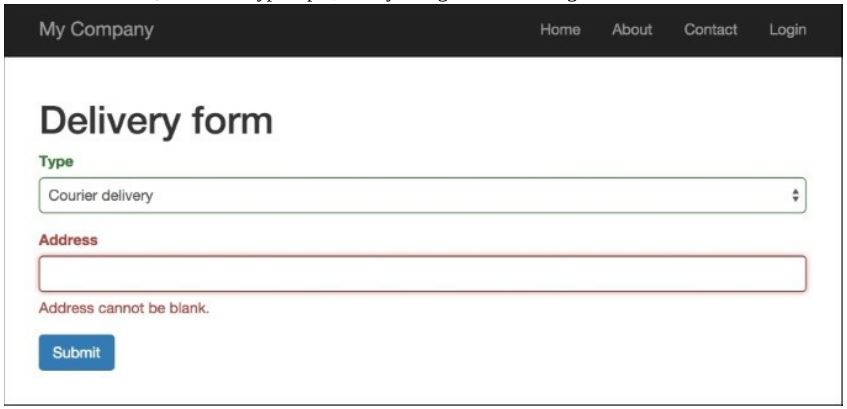

Условная проверка
===
Бывают случаи, когда необходимо включить или отключить определенные правила валидации в модели. Yii2 обеспечивает механизм для этого.

Подготовка
---
Создайте новое приложение с помощью диспетчера пакетов Composer, как описано в официальном руководстве по адресу <http://www.yiiframework.com/doc-2.0/guide-start-installation.html>.
По русски <http://yiiframework.domain-na.me/doc/guide/2.0/ru/start-installation>

Как это сделать...
---
1 Создайте файл формы @app/models/DeliveryForm.php, следующим образом:
```php
<?php
namespace app\models;
use app\components\WordsValidator;
use yii\base\Model;
class DeliveryForm extends Model
{
    const TYPE_PICKUP = 1;
    const TYPE_COURIER = 2;
    public $type;
    public $address;
    public function rules()
    {
        return [
            ['type',	'required'],
            ['type', 'in', 'range'=>[self::TYPE_PICKUP, self::TYPE_COURIER]],
            ['address', 'required', 'when' => function ($model) {
                return $model->type == self::TYPE_COURIER;
                }, 'whenClient' => "function (attribute, value) {
                return $('#deliveryform-type').val() == '".self::TYPE_COURIER."';}
                "]
        ];
    }
    public function typeList()
    {
        return [
            self::TYPE_PICKUP => 'Pickup',
            self::TYPE_COURIER => 'Courier delivery',
        ];
    }
}
```

2 Создайте файл контроллера @app/controllers/ValidationController.php, следующим образом:
```php
<?php
namespace app\controllers;
use Yii;
use yii\web\Controller;
use app\models\DeliveryForm;
class ValidationController extends Controller
{
    public function actionIndex()
    {
        $model = new DeliveryForm();
        if ($model->load(Yii::$app->request->post()) && $model->validate()) {
            Yii::$app->session->setFlash('success',
            'The form was successfully processed!'
            );
        }
        return $this->render('index', array(
            'model' => $model,
        ));
    }
}
```

3 Создайте файл представления @app/views/validation/index. php, следующим образом:
```php
<?php
use yii\bootstrap\ActiveForm;
use yii\helpers\Html;
?>
    <h1>Delivery form</h1>
    <?php if (Yii::$app->session->hasFlash('success')): ?>
    <div class="alert alert-success"><?= Yii::$app->session->getFlash('success'); ?></div>
    <?php endif; ?>
    <?php $form = ActiveForm::begin(); ?>
        <?= $form->field($model, 'type')->dropDownList($model->typeList(), ['prompt'=>'Select delivery type']) ?>
        <?= $form->field($model, 'address') ?>
        <div class="form-group"><?= Html::submitButton('Submit', ['class' => 'btn btn-primary']) ?></div>
    <?php ActiveForm::end(); ?>
```

4 Запустите контроллер проверки, открыв index. php?r=validation и выберите значение доставки курьера для ввода типа; затем вы получите следующее:


Как это работает...
---
Атрибут адрес DeliveryForm требуется, если атрибут Type имеет значение
DeliveryForm::TYPE_COURIER; в противном случае, мы выбираем опцию курьерской доставки в типе select.
Кроме того, для поддержки условной проверки на стороне клиента мы настраиваем свойство whenClient, которое принимает строку, представляющую функцию JavaScript, возвращаемое значение которой определяет, применять правило или нет.

Смотрите так же
---
Для получения дополнительной информации обратитесь к  <http://www.yiiframework.com/doc-2.0/guide-input-validation.html#conditional-validation>
По русски <http://yiiframework.domain-na.me/doc/guide/2.0/ru/input-validation#conditional-validation>
